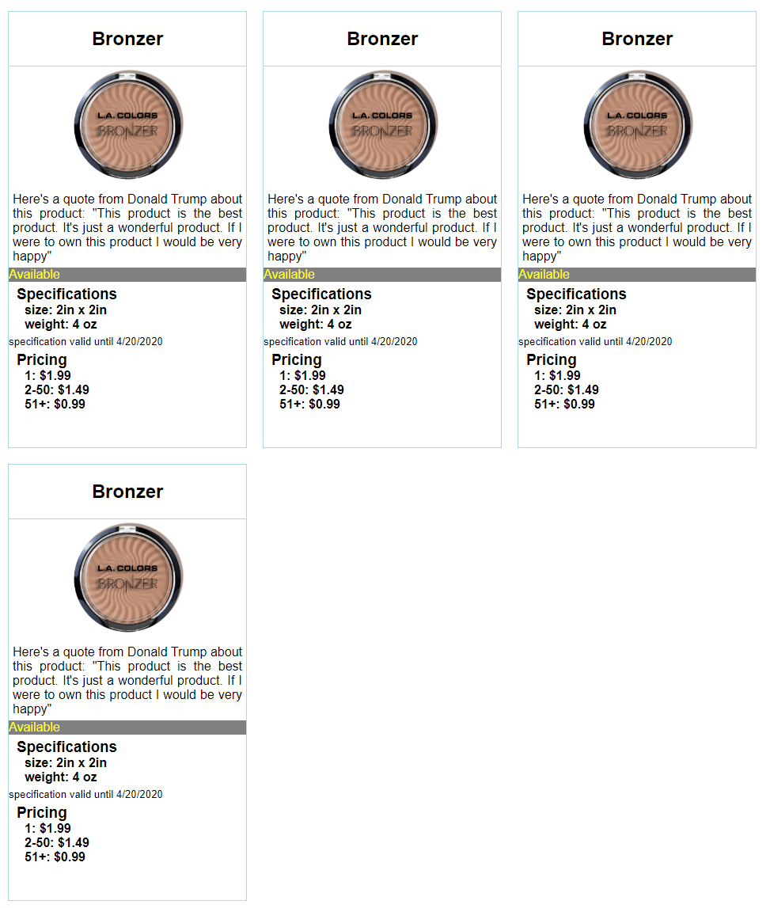

# Product Cards

This was the first project assigned.  
The point of this project was to mark and style to match a picture provided.

## Preview

## Technologies Used

 

## View Project

* Clone the repository `$ git clone git@github.com:spotmonk/product-cards.git`
* Run any HTTP server. My favorite is installed with `$ npm install http-server` and run with a `$ hs`
